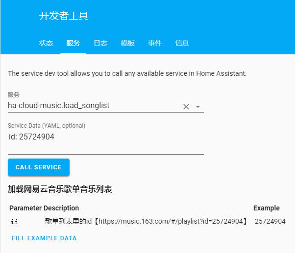
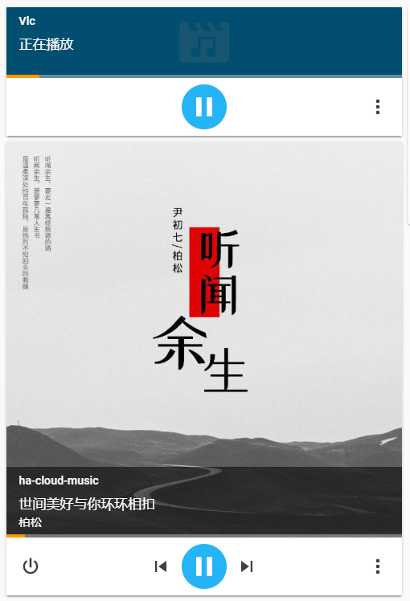
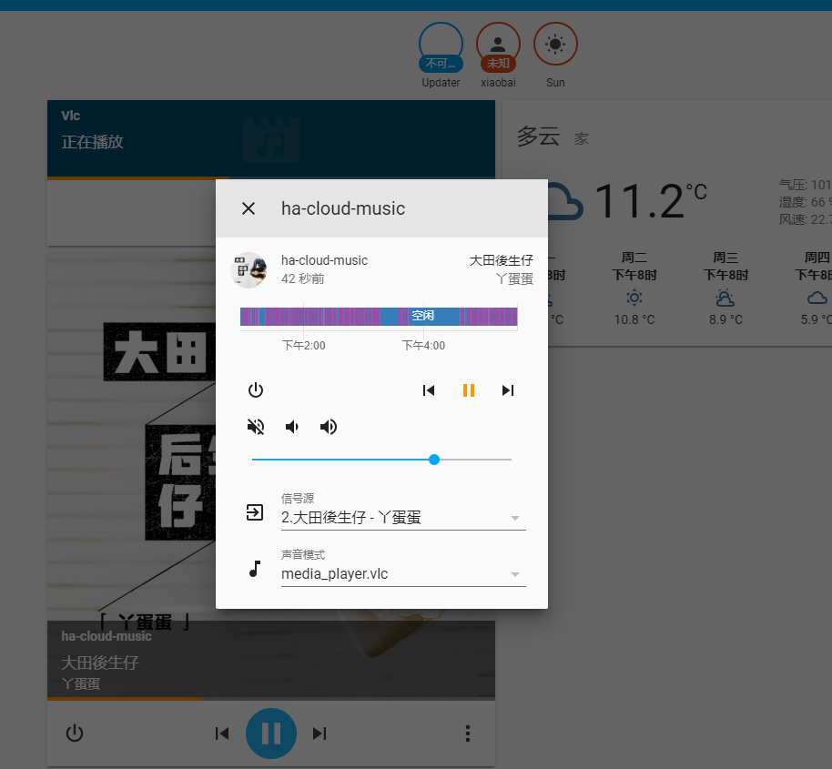
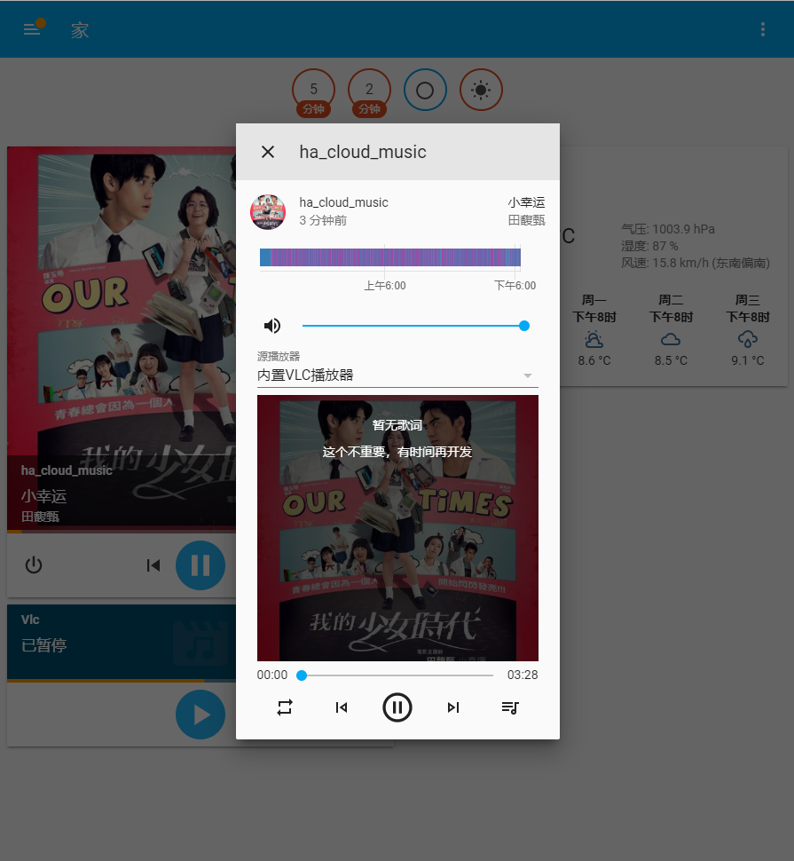

# 网易云音乐HA插件

基于第三方UI修改，配合自定义的media插件实现的后台播放功能；

> custom_components：对应的HomeAssistant自定义插件目录

> 这个前端的播放器由 [maomao1996](https://github.com/maomao1996) 开发，我只是基础上进行了修改

## 免责声明
本站音频文件来自各网站接口，本站不会修改任何音频文件

音频版权来自各网站，本站只提供数据查询服务，不提供任何音频存储和贩卖服务

本项目仅为自己测试项目，请勿用作商业用途，请勿通过本项目下载盗版歌曲资源，否则后果自负！

## 如何使用

> 安装

1.使用[HACS安装](https://github.com/custom-components/hacs)

在HACS里输入：https://github.com/shaonianzhentan/ha_cloud_music 即可安装成功（类型选择Integration）

2.自定义安装

将本项目custom_components里的内容，放到HA的custom_components文件夹中

> 后台插件配置

然后在configuration.yaml中配置以下内容
```
media_player:
  - platform: ha_cloud_music
    api_url: 接口请求地址（必填项）

```

```
# 可选配置
# api_url: 接口请求地址（必填项）
# sidebar_title: 侧边栏名称
# sidebar_icon: 侧边栏图标
# show_mode: 显示模式（全屏显示: fullscreen）
# uid: 网易云音乐的用户ID
# tts_before_message: tts服务前置消息（可选）
# tts_after_message: tts服务后置消息（可选）

media_player:
  - platform: ha_cloud_music
    api_url: 'http://localhost:3000',
    sidebar_title: 云音乐
    sidebar_icon: mdi:music
    show_mode: fullscreen
    uid: 47445304
    tts_before_message: '主人：'
    tts_after_message: '。我是爱你的小喵'
```

> 可选插件配置

```
# 文字转语音插件
# 注意：加在message之后加两个“。哦”可以解决vlc播放不完整的问题
# before_message: 添加在message之前的文字
# after_message: 添加在message之后的文字
tts:
  - platform: ha_cloud_music
    before_message: '主人：'
    after_message: '。我是爱你的小喵'
```

## 测试环境

注意：因为MPD播放器拿不到播放进度属性，可能无法自动下一曲，所以不推荐使用

### 树莓派3B+
- 使用了HAChina的镜像安装，[镜像地址](https://www.hachina.io/docs/8536.html "镜像地址")
- 系统安装了vlc播放器
- HA版本：0.98.2
- 使用vlc播放器【测试通过（完美运行）】
- 使用DLNA播放器【测试通过】
- 使用Kodi播放器【未测试】
- 使用MPD播放器【测试过】

### Windows10
- 使用pip安装的homeassistant
- 系统安装了vlc播放器
- HA版本：0.100.3
- 使用vlc播放器【测试通过（完美运行）】
- 使用Kodi播放器【测试通过】
- 使用DLNA播放器【未测试】
- 使用Android MPD播放器【测试过】

# 请一定要在HomeAssistant里使用，不然没啥用

## 功能

- 播放器
- 快捷键操作
- 歌词滚动
- 正在播放
- 排行榜
- 歌单详情
- 搜索
- 播放历史
- 查看评论
- 同步网易云歌单

## 界面欣赏

PC端界面自我感觉还行， 就是移动端界面总觉得怪怪的，奈何审美有限，所以又去整了高仿网易云的 React 版本（如果小哥哥、小姐姐们有好看的界面，欢迎交流哈）

### HomeAssistant界面
#### 服务页面

#### 播放组件

#### 播放更多信息

#### 选择媒体插件


### PC
#### 正在播放

#### 排行榜

#### 搜索

#### 我的歌单

#### 我听过的

#### 歌曲评论


### 移动端


## 更新说明

### V2.1.5
- 加入一些喜马拉雅的电台
- 加入邮箱提醒通知服务
- 加入通知内容执行功能

### V2.1.4（2019-11-23）
- 全新的查看更多面板，操作更方便
- 修复新面板的一些问题
- load服务参数修改
- load服务支持喜马拉雅专辑播放

### V2.1.3（2019-11-21）
- 加入一些电台
- 加入tts服务，语音播放后继续播放当前音乐（内置VLC播放器）
- 增加tts前后固定消息配置
- 修正tts服务，时间格式占位符的问题
- 电台列表加载服务，传入list_index会自动分页

### V2.1.2（2019-11-16）
- 解决【Anroid手机版 MPD播放器】无法自动播放下一曲的问题
- 解决不会触发其它播放器相关服务的问题
- 解决MPD播放器进度无法更新的问题
- 修正手机端样式问题
- 云音乐特色榜新增四项

### V2.1.1（2019-11-15）
- 解决接口地址使用错误的问题
- 重新整理FM电台

### V2.1（2019-11-14）
- 升级到了最新的前端页面，感谢作者 @maomao1996
- 升级到了最新的前端页面，感谢作者 @maomao1996
- 升级到了最新的前端页面，感谢作者 @maomao1996
- 重写了前端页面与HA播放器的通信逻辑
- 终于解决了 id_reuse 的错误，再也不用刷新页面了
- 终于解决了 DLNA 部分歌曲无法下一曲的问题

### V2.0.7（2019-11-12）
- 优化内置VLC播放器
- 操作响应速度更快（内置VLC播放器）
- 支持调整进度（内置VLC播放器）
- 支持静音（内置VLC播放器）
- 页面每次发送服务请求的时候，延时改为4秒
- 修改DLNA下一曲逻辑
- 加入播放模式服务（列表循环、单曲循环、列表播放、随机播放）

### V2.0.5（2019-11-04）
- 服务器被有些人恶意攻击，所以改为本地服务，需要自己本地部署安装
- 服务器被有些人恶意攻击，所以改为本地服务，需要自己本地部署安装
- 服务器被有些人恶意攻击，所以改为本地服务，需要自己本地部署安装
- 修复周杰伦的《等你下课》不能播放的问题
- 解决在搜索结果中点击播放，会出现异常的问题
- 正在播放的音乐，会有消息提示
- 解决视频搜索不能搜到电视剧的问题

### V2.0.3（2019-10-30）
- 修复kodi播放器不能自动播放下一首的问题
- 页面每次发送服务请求的时候，都执行3秒的延时
- 解决了tts语音不能播放的问题
- 新增tts插件，直接配置就能使用
- 修复内置vlc调节声音代码错误
- 解决vlc在使用tts时，语音被截断问题
- 修复刷新导致页面崩溃的问题
- 支持收听周杰伦的音乐

### V2.0.0（2019-10-29）
- 注意：因为服务不能带有“-”符号，所以名称改为下划线
- 注意：因为服务不能带有“-”符号，所以名称改为下划线
- 注意：因为服务不能带有“-”符号，所以名称改为下划线
- 新增启用随机播放模式功能
- 修复flac音乐不能播放的问题
- 新增通知功能，重要操作会有通知消息
- 新增服务，可在自动化里调用服务传入【歌单ID】和【电台ID】进行播放
- 内置VLC播放器（如果系统支持，则可以不依赖其它播放器）

### V1.0.5（2019.10.25）
- 新增配置网易用户UID的功能，不用每次都登录
- 修复连续播放进度计算的问题
- 新增播放器多个属性，支持图片封面显示

### V1.0.4（2019.10.19）
- 解决更新后页面缓存导致无法加载的问题
- 新增电视直播
- 新增视频搜索（测试功能）
- 新增视频本地播放
- 支持MPD播放器连续播放（测试功能，可能有BUG）
- 解决HomeAssistant 0.93版本中，无法添加侧边栏的问题

### V1.0.3（2019.10.14）
- 记录选中的播放器，解决每次重启服务，播放器初始化选择第一个的问题
- 解决v1.0.2里，无法读取所有播放器的问题
- 可更改侧边栏名称和图标，和显示模式（全屏显示）

### V1.0.2（2019.10.13）
- 解决DLNA播放器在没有相关属性疯狂报错的问题

### V1.0.1（2019.10.09）
- 解决反斜杠在Linux下出现错误的问题

### V1.0.0（2019.09.25）
- 将前端播放器和插件集成到一起（安装更简单）
- 解决flac无法播放不能跳到下一曲的问题
- 解决歌词显示不同步的问题
- 修复自动播放下一曲的逻辑问题
- 注释了调试日志

### V0.0.1（2019.07.06）
- 解决后台播放支持全部媒体插件的功能

## 其他说明

- 并没有全面测试，所以可能有BUG
- 如有问题请直接在 Issues 中提，或者您发现问题并有非常好的解决方案，欢迎 PR

## License

[MIT](https://github.com/maomao1996/Vue-mmPlayer/blob/master/LICENSE)
